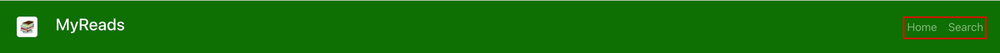
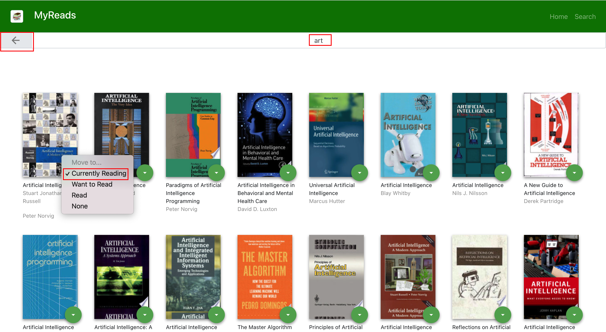

# MyReads
MyReads project is a bookshelf app that allows you to select and categorize books you have read, are currently reading, or want to read.


## Installation
The source code is hosted on GitHub. Clone the project using below mentioned github repository HTTPS URL:
```
$ git clone https://github.com/cloudblockandbeyond/my-reads.git
```

This project was bootstrapped with [Create React App](https://github.com/facebookincubator/create-react-app). Navigate to the project root directory. Install all of project's dependencies via npm using the following command:
```
$ cd my-reads
$ npm install
```

Start the development server using the following command and then navigate to http://localhost:3000 in your browser:
```
$ npm start
```

## App Functionality
The application consists of following components:

### Navigation
The navigation component consists of links to following two components:
* Home
* Search




### Home
On the home component, Books are categorized into three shelves: 
* Currently Reading
* Want To Read
* Read

To change a book's shelf or remove a book from the shelf, click on the green button on the book cover.


### Search 
To add new books, click on the green + button at the bottom of the page or on the Search link in the navigation header. Search by title or author.

